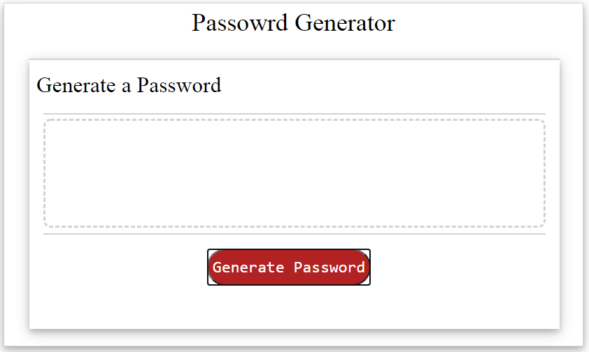

# PassWordGenerator
  
  You are now viewing the PassWordGenerator repsitory 
  Please use the following link to see published version of this repository  
  https://xtended99.github.io/PassWordGenerator/  

  The home for this project lives at the following link at GitHub  
  https://git@github.com:Xtended99/PassWordGenerator.git/  

  This assignment is to create a password generator that can create passowrd based on severla types of chracters.  
  The tool is striclty created Javascript, HTML and CSS.  
  
  Here is a quick synopsis what this README includes.  
  
  I.   The need the tool addresses.  
  I.   High level insturctions on how to use the tool.  
  II.  Pictures of each screen accompanied by caption detail below each image.  
  
  -
