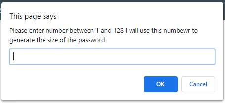
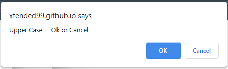
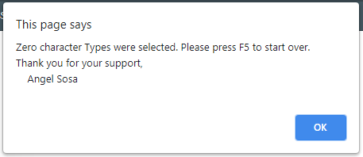

# PassWordGenerator
  
  You are now viewing the PassWordGenerator repsitory 
  Please use the following link to see published version of this repository  
  https://xtended99.github.io/PassWordGenerator/  

  The home for this project lives at the following link at GitHub  
  https://git@github.com:Xtended99/PassWordGenerator.git/  

  This assignment is to create a password generator that can create passowrds based on several types of characters.  
  The tool is striclty created in Javascript, HTML and CSS.  
  
  Here is a quick synopsis on what is included in this README    
  
  I.  [The goal for PassWord Generator.](#goal)   
  I.  [High level insturctions on how to use the tool accompaqnied with images.](#highlevel)  
  II. [Detailed pictures of each screen accompanied by a caption below each image.](#detailed-instructions)  
  
  PassWordGenerator is a tool that has been to satisfy simple password encrytpion needs. Basically  
  
  ### Goal
  The tool can create a password using:  
     1. Alphabetic characters upper and lower case for example ABC and or abc.  
     2. Numeric characters ranging from 0 - 9  
     3. The punctuation characters that would normally exist in the english language. I call these special characters.  
     4. A dedicated series of characters made up of numbers or special or characters or Alphabetic upper and lower case.  
     5. Or a combination of two or more character types or all character types.  
  
  ### HighLevel
     1. Launch the tool by going to the following link https://xtended99.github.io/PassWordGenerator/  
     2. Once loaded depress the RED password generation button.  
     3. You will then see a series of pop ups that explain what to expect and how to interact with the tool.  
     4. Once you have selected all of the character types you would like included,
     5. The password genration tool will generate your password and displayed in the main tool box.
  
  ### Detailed Instructions  
  
  
     1. **Main View**  
     
  
     2. **Greeting** Screen dialog.  
 
  
     3. **Password Size** dialog - Pick a size from 8 - 128 characters long.   
 
  
     4. **All character** dialog  - If you pikc this dialog you will not be prompted with any other choices.  
     
  
     5. **Upper** case dialog.  

  
     7. **Lower** case dialog.  

  
     8. **Special** characters dialog.  

  
     9. **Did Not** pick dialog. This dialog appears if you did not pick a character type.  
 
Have fun and enjoy!!  
   Angel Sosa

