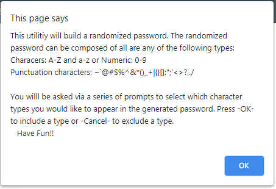
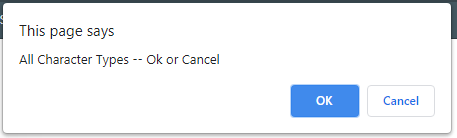
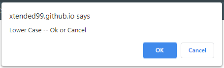
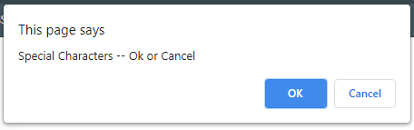

<<<<<<< HEAD
#  WorkReference  
WorkeReference  

  Please use the following link to see published version of this repository https://xtended99.github.io/WorkReference/  

  The home for this project lives at the following link at GitHub https://github.com/Xtended99/WorkReference  

  This assignment is to create a site from the ground up. Zero code has been provided. The tools must with  
  there own set of tools and use the experince of the last two weeks to build this site. This assignment also 
  makes use and and last weeks assignment.

  Since I am building n my own the site I have added several CSS features for example tabbing, larger fonts,  
  links on the top and on the bottom. As time goes on I will be continuing perfecting the site. We can say  this  
  will be under construction for the next 24 weeks.

Given:

  I have followed the guidelines and home work requirements to work with please see below for  
 modifications, changes additions and removal of no longer needed artifacts.

    1. Read and observed the following Guidance Documents.

      I.    Guidance doumnet at the root of the Course Directory - 
      II.   Guidance doumnet at the root of the Course week Directory - 
      III.  Guidance doumnet at the root of the Course week Directory Homework Directory - 
      IV.   Guidance doumnet at the root of the Course week Directory Homework Guidance Directory - 

   2. Experience the user should expect - User Story

      I.    AS AN employer  
      II    I WANT to view a potential employee's deployed portfolio of work samples  
      III   SO THAT I can review samples of their work and assess whether they're a good candidate for an open position  
  
   3. Website incorporated feature sets and expectations - Acceptance Criteria  
  
      I.    GIVEN I need to sample a potential employee's previous work  
      II.   WHEN I load their portfolio  
      III.  THEN I am presented with the developer's name, a recent photo or avatar, and links to sections about them, their work, and how to contact them  
      IV.   WHEN I click one of the links in the navigation  
      V.    THEN the UI scrolls to the corresponding section  
      VI.   WHEN I click on the link to the section about their work  
      VII   THEN the UI scrolls to a section with titled images of the developer's applications  
      VIII. WHEN I am presented with the developer's first application  
      IX.   THEN that application's image should be larger in size than the others  
      X.    WHEN I click on the images of the applications  
      XI.   THEN I am taken to that deployed application  
      X.    WHEN I resize the page or view the site on various screens and devices  
      XI.   THEN I am presented with a responsive layout that adapts to my viewport  
  
  
   4. My Comments that are embedded into the HTML source file and the CSS Style sheet 
      have been collected here for your convenince. Look for the seperating ----\
      .
      Thank You -- Angel Sosa

            -----------------------------------

       Most if not all original selectors and elements where removed or compressed in order to refactor the HTML page
         and make the style sheet more efficient. 

         Accesability features were added to the CSS Style sheet,
          TAB order with black border highlight
          Color hovering throughout the page
         
         I also took the liberty of changing the following 
            Making the left and right panel match on the button margin
            Enlarging and selecting a different so that is visually more accessible to a wider range of individuals 
            Added underlines to accentuate the links on the page

            -----------------------------------

          This a generic selector  that selects all elements

            -----------------------------------

          This selector is for the "header element by setting the following values width, padding, background-color and color.

            -----------------------------------

          This is ther body selctor. This is setting the background color for the parts of the page that are exposed

            -----------------------------------

          This is the element for an unordered list. I kept the unordered list so that I can use a pseudo class first child selector
          Please see below for li.company-name:first-child

            -----------------------------------

          The UL were wrapped in a NAV element to statisfy the requirements of the homework. 
          This is a generic li to set the common proeperties

            -----------------------------------

          Specific proeprties had to be set in ordfewr fot to formatted left

            -----------------------------------

          Specific proeprties were set for the remianing li child elements.

          hover, a:hover, visited were setup to natural interact with individuals that do not feel comfortable using a mouse.
          You will also notice that the tab order has been set with in the html file

            -----------------------------------

          This is a paragrapgh element

            -----------------------------------

          hero, float-left, .float-right, .content, .p-side, .benefits are class that exist in the html file.

            -----------------------------------

          float left postions the image to the left 

          float right postions the image to the right

            -----------------------------------

          Was convereted from div to section  and sets the following thrtee properies throughout the html
         .content
            -----------------------------------

          p-side was created to set the properties seperately to the panal on the right hand side page

            -----------------------------------

          All of benefits selectors collapsed several html elements, benefits is the overarching sectionh,
          benmefit-32 sets the margin and color
          benefits 32 h3 sets the properties for h3 headers. 
          benefits-32 img set the propertiesd for all of the images. 

         All of search-engine-reputation-media selectors collapsed several html elements, 
         search-engine-reputation-mediai, search-engine-reputation-media sets 
              the margin, color, padding, weight, font family, background color
         search-engine-reputation-media h2 sets the properties for h2 headers. 
         search-engine-reputation-media img set the propertiesd for all of the images. 

         The div footer was removed and converted to the HTML footer tag

=======
# PassWordGenerator
  
  You are now viewing the PassWordGenerator repsitory 
  Please use the following link to see published version of this repository  
  https://xtended99.github.io/PassWordGenerator/  

  The home for this project lives at the following link at GitHub  
  https://git@github.com:Xtended99/PassWordGenerator.git/  

  This assignment is to create a password generator that can create passowrds based on several types of characters.  
  The tool is striclty created in Javascript, HTML and CSS.  
  
  Here is a quick synopsis on what is included in this README    
  
  I.  [The goal for PassWord Generator.](#goal)   
  I.  [High level insturctions on how to use the tool accompaqnied with images.](#highlevel)  
  II. [Detailed pictures of each screen accompanied by a caption below each image.](#detailed-instructions)  
  
  PassWordGenerator is a tool that has been to satisfy simple password encrytpion needs. Basically  
  
  ### Goal
  The tool can create a password using:  
     1. Alphabetic characters upper and lower case for example ABC and or abc.  
     2. Numeric characters ranging from 0 - 9  
     3. The punctuation characters that would normally exist in the english language. I call these special characters.  
     4. A dedicated series of characters made up of numbers or special or characters or Alphabetic upper and lower case.  
     5. Or a combination of two or more character types or all character types.  
  
  ### HighLevel
     1. Launch the tool by going to the following link https://xtended99.github.io/PassWordGenerator/  
     2. Once loaded depress the RED password generation button.  
     3. You will then see a series of pop ups that explain what to expect and how to interact with the tool.  
     4. Once you have selected all of the character types you would like included,
     5. The password genration tool will generate your password and displayed in the main tool box.
  
  ### Detailed Instructions  
  
  
     1. **Main View**  
     
  
     2. **Greeting Screen dialog.  
 
  
     3. **Password Size** dialog - Pick a size from 8 - 128 characters long.   
 
  
     4. **All character** dialog  - If you pikc this dialog you will not be prompted with any other choices.  
     
  
     5. **Upper** case dialog.  

  
     7. **Lower** case dialog.  

  
     8. **Special** characters dialog.  

  
     9. **Did Not** pick dialog. This dialog appears if you did not pick a character type.  
 
>>>>>>> b252018f6464b0b9fa59e63bde000b44fd317107
